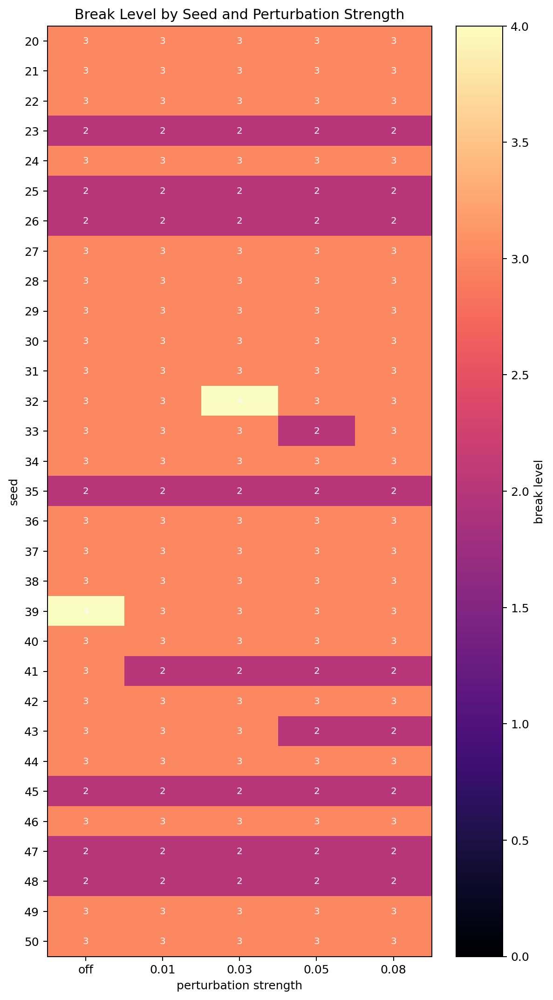
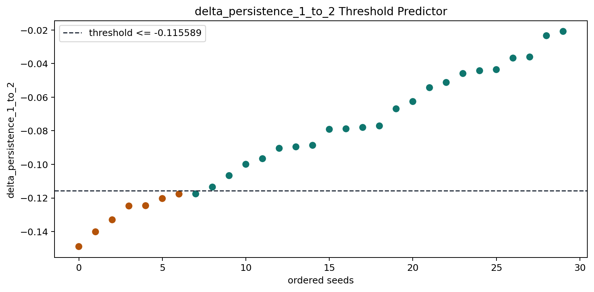
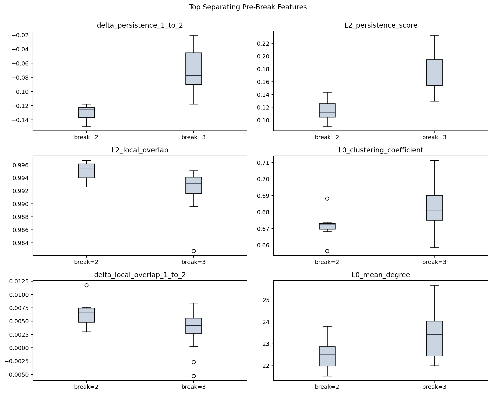
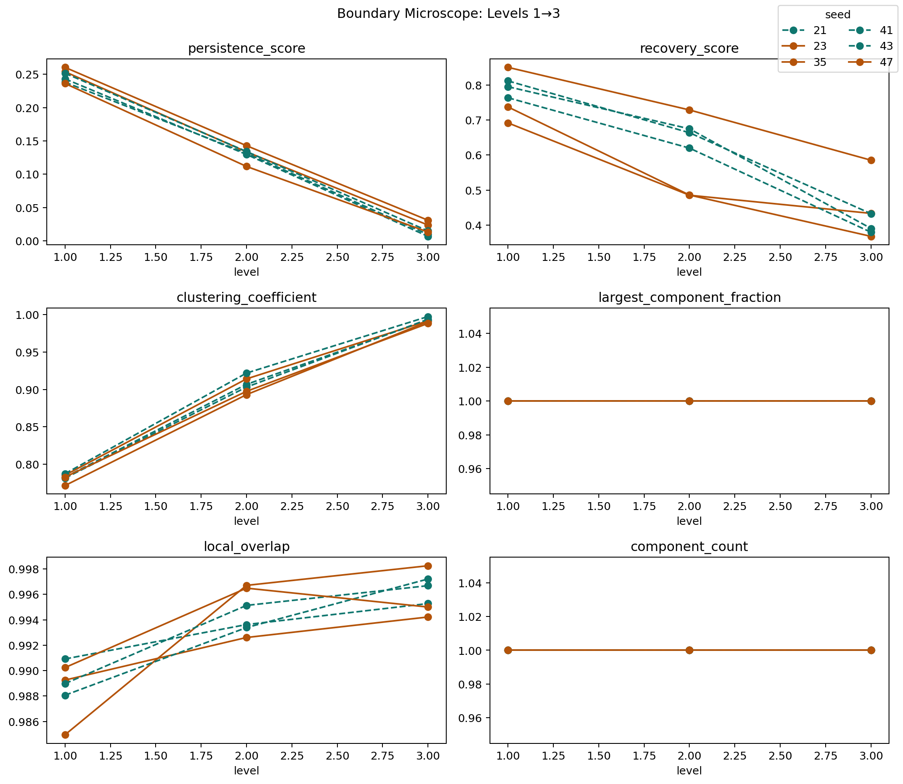
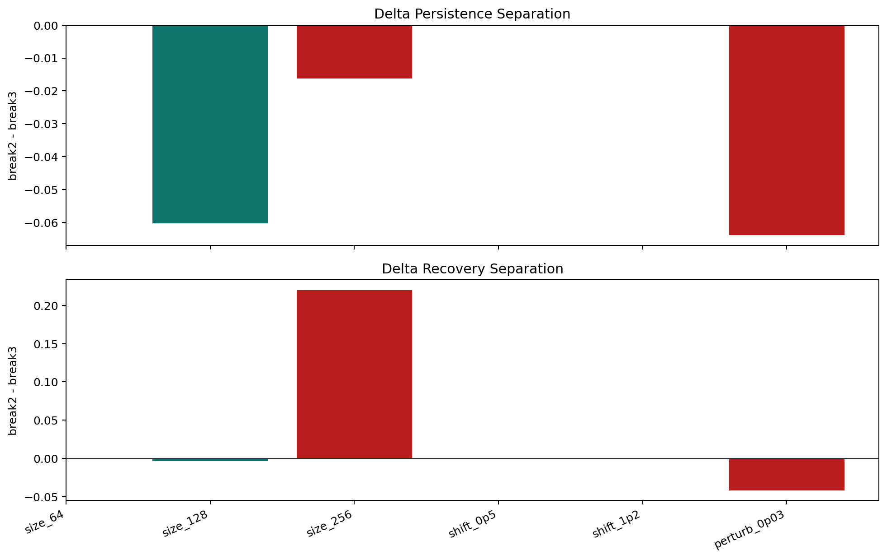
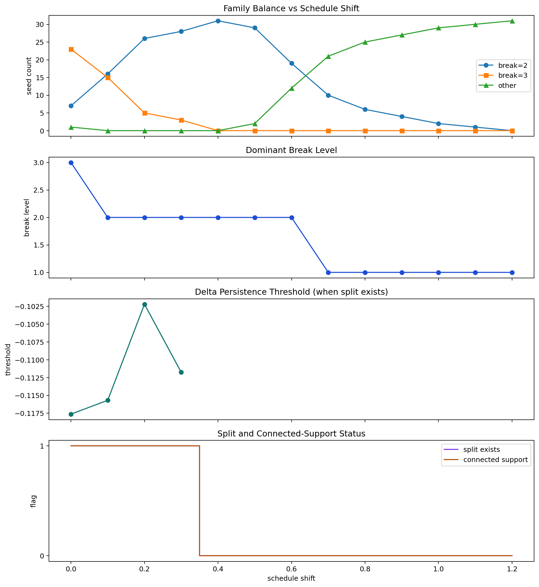

# HAOS Genesis: A Path-Dependent Persistence Probe with a Predictable Collapse Boundary

## Abstract

HAOS Genesis is a self-contained graph-based persistence engine designed to test whether
structure survives constrained transformation. The system constructs an initial interaction
graph, evolves that graph along a frozen hierarchy, and measures persistence, recovery,
and overlap at each step. The present implementation is intentionally narrow: it is not a
physical theory, but an operational probe for collapse and survival under cumulative change.

The main result is a validated base-regime mechanism. In the regime defined by size `128`,
schedule shift `0.0`, and perturbation `off`, collapse concentrates in a narrow band at
levels `2-3`. Break family is predictable before collapse from the derivative signal
`delta_persistence(1->2)`, with held-out accuracy `0.875` and a transition band localized
near `-0.1176`. Boundary inspection shows the deciding event is not graph fragmentation:
support remains connected while break-2 seeds suffer a stronger consolidation loss than
break-3 seeds. Variant testing shows that this mechanism should remain regime-local.
Schedule shift acts as a control parameter that compresses and then erases the original
`2 vs 3` split. The current implementation also exposes this boundary operationally through
the shared primitive `k_star = argmin delta_persistence`, a deterministic stability monitor,
and an agent-callable skill for synthetic or external graph inputs.

## 1. Introduction

The original risk in this class of system is to confuse a parameter sweep with an evolution.
If each hierarchy level is rebuilt independently, there is no accumulation, no memory, and
no honest persistence test. HAOS Genesis addresses that problem by imposing a path-dependent
refinement rule.

The goal is minimal and operational:

1. define a deterministic graph universe
2. apply constrained transformation through a frozen hierarchy
3. measure whether structure survives
4. detect and predict collapse when it does not

The system is not asked to explain physics or emergence. It is asked to expose whether a
reproducible collapse boundary exists, whether that boundary is predictable before it is
crossed, and whether the mechanism can be described honestly within the observed regime.

## 2. System Definition

### 2.1 Universe

A universe is defined as:

`(G0, hierarchy trace, metrics trajectory)`

Where `G0` is the initial interaction graph, the hierarchy trace is the sequence of refined
states, and the metrics trajectory records persistence-related measurements at each level.

### 2.2 Graph Construction

Nodes are placed deterministically in two-dimensional unit space using a seeded random generator.
Pairwise Euclidean distances are converted into a Gaussian affinity matrix:

`A_ij = exp(-d_ij^2 / (2 sigma^2))`

Edges beyond the locality radius are removed, and diagonal entries are set to zero.

### 2.3 Frozen Hierarchy

For size `N`, the base scale is:

`h = 1 / round(sqrt(N))`

At hierarchy level `l`, the kernel width is:

`sigma_l = (l + 1 + s) h`

where `s` is the schedule shift control parameter. The locality radius is:

`r_l = min(3 sigma_l, sqrt(2))`

## 3. Path-Dependent Update Rule

The central correction in HAOS Genesis is the replacement of independent rebuilding with
refinement from the previous state.

Given the previous graph `A_prev`:

1. rebuild only the target support with the new kernel width while preserving node geometry
2. compute a transport operator `T` from the previous graph
3. evolve the prior affinity:

`A_evolved = T A_prev T^T`

4. constrain the evolved affinity by the new support:

`A_new = min(A_evolved, A_target)`

This update preserves geometry, carries forward memory, and introduces irreversibility.

## 4. Perturbation

Perturbation is deterministic for a fixed seed and level.
The current perturbation engine applies:

1. weight jitter
2. low-probability rewiring
3. rare node removal below one percent

Perturbation is applied after each hierarchy level when enabled.
The original graph is not mutated.

This design is useful but not interpretation-neutral: the node-removal component can create
small explicit fragmentation and therefore must be treated separately from non-fragmenting stress.

## 5. Metrics

Per-level metrics include:

1. `largest_component_fraction`
2. `clustering_coefficient`
3. `connectivity_diameter`
4. `transport_efficiency`
5. `persistence_score`
6. `recovery_score`
7. `overlap`
8. `perturbation_sensitivity`

The generator adds two trajectory metrics:

1. `local_overlap`
2. `delta_persistence`

These are essential. The later analysis shows that the derivative signal `delta_persistence`
is more informative than the absolute persistence level for predicting collapse family.
From this trajectory the system derives a shared transition primitive:

`k_star = argmin delta_persistence(k -> k+1)`

`k_star` identifies the step with the strongest consolidation failure. In the validated
base regime that critical step is centered on the `1->2` transition; under sufficiently
shifted schedules, the critical step moves earlier.

## 6. Experimental Program

The present package includes the full analysis workflow used to derive the current results:

1. collapse mapping across seeds and perturbation strengths
2. break-family comparison for `break=2` versus `break=3`
3. minimal threshold prediction from pre-boundary features
4. boundary microscopy on seeds nearest the threshold
5. mechanism validation across size, shift, and perturbation variants
6. schedule-shift sweep as a control program
7. deterministic example programs on external or synthetic graph scenarios
8. a practical monitor layer exposing the same trace logic through `StabilityMonitor`,
   `predict_collapse`, and `haos_stability_skill`

All outputs are stored inside `haos_genesis/output/`.

## 7. Results

### 7.1 Collapse Band

Across seeds `20-50` and strengths `off`, `0.01`, `0.03`, `0.05`, and `0.08`,
break levels were distributed as:

- level `2`: `42`
- level `3`: `111`
- level `4`: `2`

The dominant collapse band is therefore levels `2-3`.

By perturbation strength:

- `off`: `{2: 7, 3: 23, 4: 1}`
- `0.01`: `{2: 8, 3: 23}`
- `0.03`: `{2: 8, 3: 22, 4: 1}`
- `0.05`: `{2: 10, 3: 21}`
- `0.08`: `{2: 9, 3: 22}`

Mean final overlap and recovery drift downward with stronger perturbation, but the break band
does not smear outward. Perturbation changes severity more than location.



### 7.2 Pre-Collapse Prediction

In the base regime, `delta_persistence(1->2)` is the strongest predictor of collapse family.
Operationally, the threshold feature remains `delta_persistence(1->2)`, while `k_star`
records where the largest drop occurs across the full trace.

Threshold fit:

- rule: predict `break=2` if `delta_persistence(1->2) <= -0.1155894886363636`
- training accuracy: `1.000`
- held-out accuracy: `0.875`

The transition band is microscopically narrow:

- break-2 seed `35`: `-0.11766937335958003`
- break-3 seed `41`: `-0.1175659150560725`
- midpoint: `-0.11761764420782626`

`L2_persistence_score` is also predictive, but weaker as a training separator.



### 7.3 Family Separation

Base-regime effect sizes show that the split is decided before the boundary:

1. `delta_persistence_1_to_2`: `-2.3289`
2. `L2_persistence_score`: `-2.0599`
3. `L2_local_overlap`: `1.0273`
4. `L0_clustering_coefficient`: `-0.9327`
5. `delta_local_overlap_1_to_2`: `0.9034`

This means collapse is not best predicted from the state at level `2`, but from the failure
to consolidate structure during the transition into level `2`.



### 7.4 Boundary Microscope

The six seeds nearest the threshold were:

- break-2: `35`, `23`, `47`
- break-3: `41`, `43`, `21`

Across these seeds, support remains connected through levels `1-3`:

- `largest_component_fraction = 1.0`
- `component_count = 1`

Average traces show the deciding split is consolidation loss:

- break-2, level 1:
  - persistence `0.250181`
  - recovery `0.759912`
- break-2, level 2:
  - persistence `0.129318`
  - recovery `0.566563`
- break-3, level 1:
  - persistence `0.244314`
  - recovery `0.790222`
- break-3, level 2:
  - persistence `0.131726`
  - recovery `0.652817`

The collapse boundary is therefore not a fragmentation boundary.
It is a coherence or consolidation boundary inside connected support.



### 7.5 Mechanism Validation

Mechanism validation was intentionally used to prevent over-generalization.

For the base regime:

- `size_128`, `shift_0.0`, `perturbation_off`
- connected support holds
- stronger `1->2` consolidation loss separates break-2 from break-3

For variants:

- `size_256`
  - support remains connected
  - but the family balance collapses to `30 vs 1`, so the two-family mechanism is not stable enough there
- `perturbation_0.03`
  - derivative separation remains visible
  - but explicit node removal introduces small fragmentation
- shifted schedules
  - erase the original family split rather than preserving it

These results support a narrow mechanism claim, not a universal one.



### 7.6 Schedule Shift as Control

Schedule shift behaves as a true control parameter.

Family balance evolves as follows:

- `0.0`: break-2 `7`, break-3 `23`, dominant break `3`
- `0.1`: break-2 `16`, break-3 `15`, dominant break `2`
- `0.2`: break-2 `26`, break-3 `5`, dominant break `2`
- `0.3`: break-2 `28`, break-3 `3`, dominant break `2`
- `0.4`: all seeds break at `2`
- `0.7`: dominant break shifts to `1`
- `1.2`: all seeds break at `1`

The original `2 vs 3` split exists only for shifts `0.0-0.3`.
After that, the comparison regime itself disappears.

This control result can be stated more cleanly through `k_star`. In the base regime the
dominant collapse-driving step is the `1->2` transition (`k_star = 1`). As shift increases,
the strongest consolidation failure moves earlier, and by the time `break=1` becomes dominant
the critical transition has advanced toward `0->1` (`k_star = 0`). Schedule shift therefore
does not simply change the observed break level. It advances the critical transition index.



## 8. Discussion

The main significance of HAOS Genesis is not that it collapses.
Many systems collapse. The important result is that collapse becomes predictable before it
happens, and that the predictor is a derivative signal localized to a specific transition step.

The strongest current interpretation is:

collapse is preceded by insufficient consolidation during the `1->2` transition.

This is stronger than saying that low persistence is bad.
It says the decisive signal is not simply the state but the failed transition.

Just as importantly, the package now separates regime-local truth from broader speculation.
The base mechanism holds where it was validated. Outside that regime, the system reveals
different control structure instead of being forced back into the same explanation.

The current practical layer matters because it closes the loop between analysis and use.
The same trace logic now appears in three increasingly narrow interfaces:

1. `StabilityMonitor`, which analyzes an existing trace
2. `predict_collapse(trace)`, which exposes the thresholded predictor directly
3. `haos_stability_skill(payload)`, which accepts either a synthetic configuration or an
   external graph and returns a fixed machine schema:

```text
{
  "k_star": int,
  "predicted_break": int,
  "safety_margin": float,
  "min_delta": float,
  "confidence": float
}
```

This does not make HAOS Genesis a market model, anomaly classifier, or universal network
theory. It makes the system a deterministic stability probe whose output can be compared
across runs and embedded inside agent workflows without changing the underlying math.

## 9. Limitations

The current implementation has five important limits.

1. perturbation mixes non-fragmenting and fragmenting effects
2. the larger-size regime is not yet mapped as carefully as the base regime
3. schedule shift changes regime identity, so threshold comparisons do not extend automatically
4. all metrics are operational graph observables, not deeper field variables
5. external-graph mode is representation-sensitive, because positions and affinity scaling
   can change the observed trajectory even for topologically similar graphs

These are not defects to hide. They are boundaries of the current claim.

## 10. Conclusion

HAOS Genesis now supports a complete minimal loop:

1. path-dependent evolution
2. collapse detection
3. pre-collapse prediction
4. mechanism validation
5. control mapping
6. a fixed practical interface for deterministic stability monitoring

The validated base-regime claim is therefore:

In the regime defined by size `128`, schedule shift `0.0`, and perturbation `off`, a seed
breaks at level `2` rather than `3` when the `1->2` transition produces a stronger consolidation
loss, while connected support remains intact.

That claim is narrow, reproducible, and operationally grounded.

## Appendix A. Reproducibility Commands

```bash
python3 collapse_map.py --seed-start 20 --seed-stop 50
python3 compare_seed_families.py
python3 predict_collapse.py
python3 boundary_microscope.py
python3 validate_mechanism.py
python3 shift_sweep.py --seed-start 20 --seed-stop 50
python3 examples/demo_real_graph.py
python3 examples/demo_network_failure.py
python3 docs/build_technical_paper_pdf.py
```
